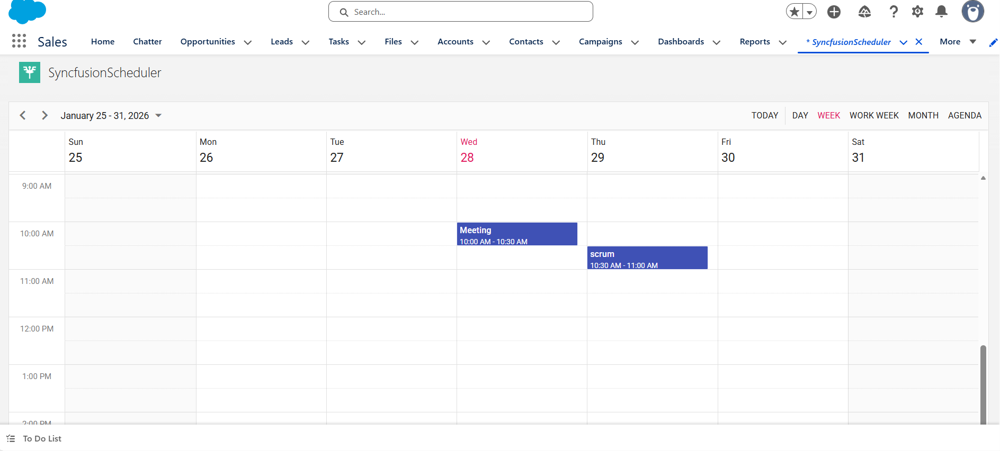

# salesforce-integration-in-ej2-javascript-scheduler

### Prerequisites

- [Salesforce CLI](https://developer.salesforce.com/tools/sfdxcli)

### Configure salesforce

1.[Sign up](https://developer.salesforce.com/signup) with salesforce developer account, if you don’t have salesforce account

2.[Log in](https://login.salesforce.com/) with salesforce account

3.After successful login with salesforce, search for `Dev hub` in quick find search box and select dev hub

4.Ensure the `Enable Dev Hub` option is enabled, if not enable it

### Deployment

1.Clone this project

2.Open salesforce\scheduler-salesforce-app\sfdx-project.json file and update the `sfdcLoginUrl` with domain url, which is get from salesforce Setup > My Domain

3.Authorize the DevHub in the project 
>sf org login web --set-default-dev-hub

4.In the cloned project create scratch org using below command

> sf org:create:scratch -f config/project-scratch-def.json

5.Open your scratch org in brower using below cmd

> sf org:open -o {scratch org user name}

6.Deploy the project using below command

> sf project:deploy:start -o {scratch org use name}

### Scheduler Integration

1.In scratch org url, click app launcher icon and search for `SyncfuionScheduler`.

2.Select syncfusion scheduler to load the scheduler as custom component in salesforce 

### Output Preview

### Troubleshooting 

**License banner:** Obtain and register a Syncfusion license key [Link](https://ej2.syncfusion.com/angular/documentation/licensing/overview).